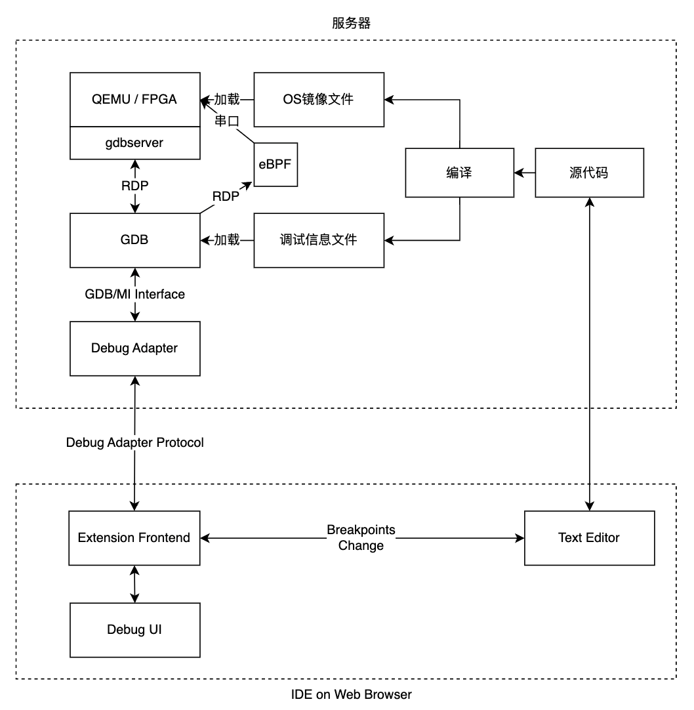

整体架构设计
=====================================

.. toctree::
   :hidden:
   :maxdepth: 5

我们设计的在线调试系统通过调试者和被调试内核分离的设计来实现 Qemu 虚拟机或真实系统上的操作系统远程调试。内核在服务器上运行，用户在浏览器里发送调试相关的请求，如下图所示。

在图2.1中，源代码指待编译的操作系统的源代码，当用户发出编译请求时，服务器中的 rust 工具链会通过特定的编译参数编译操作系统源代码，产生满足操作系统调试要求的操作系统镜像和调试信息文件。如果用户接下来发出调试请求，服务器中的 Qemu 或服务器连接的 FPGA 硬件就会加载操作系统镜像（本项目以 Qemu 为例），服务器中的 GDB 会加载调试信息文件并连接至 Qemu 的 gdbserver。

图中 Extension Frontend 是运行在用户浏览器中负责操作系统调试相关功能的模块。Debug Adapter 是运行在服务器中的独立进程，负责处理 Extension Frontend 发送来的请求。当 GDB 成功加载调试信息文件并连接至 Qemu的 gdbserver 后，Debug Adapter 进程启动并开始接收 Extension Frontend 发送来的请求。Debug Adapter 会将请求转换为 GDB 指令发送给 GDB。GDB 在执行完 GDB 指令后将 GDB/MI 格式的信息返回给 Debug Adapter。Debug Adapter 解析后将结果返回给 Extension Frontend。

如果用户开启了 eBPF 跟踪功能，相关的eBPF模块（eBPF Server、GDB中的通信模块、在线IDE的用户界面等）会随着GDB的启动而激活，提供更加强大和灵活的动态跟踪调试功能。

Extension Frontend 收到 Debug Adapter 发送来的消息后，会将这些消息转换为界面更新消息，发送给在线IDE上的调试界面（图中 Debug UI）和文本编辑器模块（图中 Text Editor）。同样，Debug UI 和Text Editor 也可以向 Extension Frontend 发送消息，比如断点更新消息。
要完成以上的流程，服务器中需安装 openvscode-server、操作系统调试模块（以VSCode插件的形式提供）、Qemu，包含GDB-python的risc-v工具链、rust 工具链。用户可以手动配置服务器中的安装这些软件，也可以使用我们配置好的包含以上工具的 docker 容器，免去了配置的麻烦。
接下来我们分服务器和网页端两个部分介绍这套远程调试工具。
