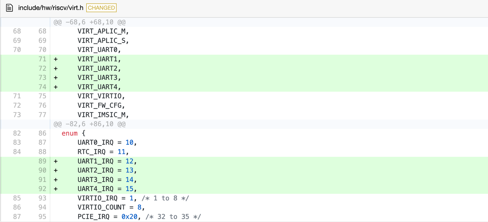
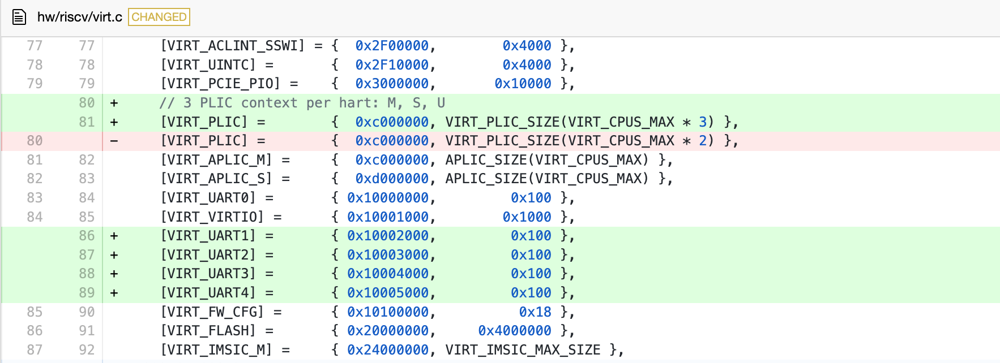
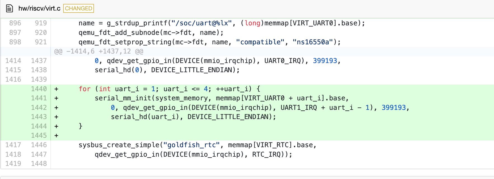
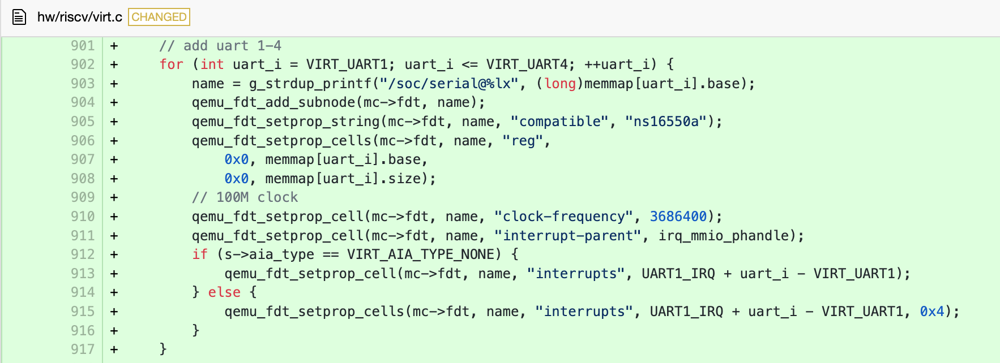
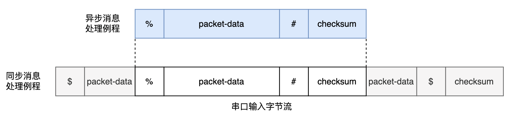

多道程序与协作式调度
=========================================

整体构想
--------------------------

我们的整体构想是，运用两种跟踪技术，即 gdbserver 和 eBPF server ，同时跟踪同一个目标（target），即虚拟机中运行的rCore-Tutorial-v3 操作系统。我们把会改变操作系统状态的那个跟踪技术（Qemu 的 gdbserver 或 OpenOCD ）称为 main-stub，eBPF 的 gdbserver 称为 side-stub。Main-stub 具有可以改变操作系统运行状态的控制能力，而 side-stub 只负责收集信息，不影响内核的状态。下表详细展示了 main-stub 和 side-stub 功能与局限，可以看出，二者形成了很好的互补：

表3.1 eBPF Server 和 gdbserver 对比

+-----------------------+-----------------------+-----------------------+
|                       | **基于eBPF的eBPF      | **Qemu的gdbserver**   |
|                       | Server**              |                       |
+=======================+=======================+=======================+
| 读内存，读寄存器      | 可以                  | 可以                  |
+-----------------------+-----------------------+-----------------------+
| 写内存，写寄存器      | 不可以                | 可以                  |
+-----------------------+-----------------------+-----------------------+
| 获取                  | 方便                  | 繁琐                  |
| 进程控制块等内核信息  |                       |                       |
+-----------------------+-----------------------+-----------------------+
| 停下（halt）          | 不可以                | 可以                  |
+-----------------------+-----------------------+-----------------------+
| 单步                  | 不可                  | 可以                  |
|                       | 以（原因是不能停下）  |                       |
+-----------------------+-----------------------+-----------------------+
| watchpoint            | 不可                  | 可以                  |
|                       | 以（原因是不能停下）  |                       |
+-----------------------+-----------------------+-----------------------+
| 跟踪函数调用关系      | 优点                  | 优点：查看函数调用栈  |
|                       | ：查看函数调用的参数  |                       |
+-----------------------+-----------------------+-----------------------+
| 断点                  | 类                    | 断点                  |
|                       | 似tracepoint，触发后  | 触发后被调试的操作系  |
|                       | 被调试的操作系统不能  | 统会停下，这对于第二  |
|                       | 停下，主要起辅助作用  | 章所述的一些静态分析  |
|                       |                       | 功能来说是必不可少的  |
+-----------------------+-----------------------+-----------------------+
| 跟踪异步函数          | 由于可以编写          | 较繁琐                |
|                       | 帮助函数，因此较方便  |                       |
+-----------------------+-----------------------+-----------------------+

利用 GDB 自带的远程调试功能和 Qemu 自带的 gdbstub 功能，我们很容易就能建立 main-stub 和 GDB 的连接。接下来要解决的问题就是如何让 GDB 在连接到 main-stub 的同时也连接到 side-stub，即我们编写的 eBPF server。

GDB 和 main-stub 用 TCP 协议通信，但是由于主线版本的 rCore-Tutorial-v3 暂未提供稳定的网络协议栈和网卡驱动支持（不论是真实网卡还是 Qemu 虚拟机的 virtio 虚拟设备）且 eBPF server 是运行在操作系统里的，因此若要让 eBPF server 用TCP协议连接到 GDB ，实现难度比较大。我们在调研了各种调试器与调试器服务器通信的方案后，选择用串口进行二者的通信。

基于串口的 GDB 与 eBPF server 的通信机制
-----------------------------------------------s

将由于 rCore-Tutorial-v3 的终端已经占用了一个串口用于文字输入输出，为了不影响操作系统的运行状态，eBPF Server 需要用另一个专属的串口来和 GDB 通信。关于给虚拟机添加更多串口，大部分网上的资料仅提到添加一个 Qemu 启动参数，但是经过实际测试后发现这不起作用。原因是Qemu 虚拟机并未支持 RISC-V 平台的多串口收发。因此，我们修改了 Qemu 虚拟机的源代码，为新串口分配了 MMIO 地址和 IRQ（中断号）：

还修改了设备树初始化函数：

我们发现运行在修改后的 Qemu 中的 rCore-Tutorial-v3 操作系统可以给第二个串口发送消息，但不能接收基于中断机制的消息。这是因为在 RISC-V 中，存在用于保护物理地址的寄存器 pmpcfg 和 pmpaddr [6]。而 rCore-Tutorial-v3 的 SBI（rustsbi-qemu）通过设置这两个寄存器的值，使得只有 SBI 部分和 OS 所在的地址空间可以使用，而PLIC、串口等设备所在的物理地址不可以使用。为了调试方便，我们修改了SBI对 pmpcfg 和 pmpaddr 的设置，使得所有物理地址都可以被使用。

同时，为了支持第二个串口的通信，我们参考原有的串口相关的代码，对 rCore-Tutorial-v3 做了尽可能少的修改，修改内容包括：添加第二个串口的初始化例程、修改中断处理例程、添加用于在第二个串口收发单字节的系统调用和 eBPF 帮助函数（helper functions）。

至此，我们实现了基于中断的多串口数据收发，使得 GDB 与 eBPF server 可以通过串口通信。需要注意的是，eBPF 依赖的内核模块是不能通过 eBPF 本身来调试的。比如，eBPF Server 依赖内核的串口，如果我们试图让 eBPF server 跟踪这个串口的行为，那么 eBPF Server 收集的数据也会通过这个串口来发送，这又会触发 eBPF Server 的跟踪，进而陷入死循环。

在 GDB 和 eBPF Server 之间实现 RSP 协议
-------------------------------------------------------------------

在串口或网络之上，GDB 和 main-stub 之间用 RSP 高层协议进行通信。RSP协议规定的基本消息单位是由ASCII字符组成的数据包（Packet），数据包的格式如下图所示：

其中，“$”用于标识数据包的开头，packet-data是传送的实际数据，checksum（即校验值）是“$”和“#”之间所有字符的模 256 和，它是八位无符号整数，编码成ASCII字符后一定占用两个字符，所以“checksum”这三个字符标示了一个数据包的结束。通信的双方在接收到数据包后，可以发送单个“+”字符表示数据包接收成功，或发送"-"表示数据包接收失败，要求重发。

除此之外，还有一种通知数据包（Notification Packet）。它和普通的数据包的区别有两个：1）普通数据包的交流机制是同步的，而通知数据包是异步的，常用于通知 GDB 某个事件的发生，2）收到通知数据包后无需像普通数据包一样发送“+”或“-”。通知数据包的格式如下图所示，可以看到，通知数据包以字符“%”标识开头，而其余的格式和普通的数据包是一致的：

这套协议比较简明，且能满足我们的需求，因此，我们在GDB中增加一个子模块，让这个子模块使用 RSP 协议和 side-stub 进行通信。考虑到这个子模块将会有一个持续从串口接收字节流的线程，且有很多字符串处理流程，我们选择用 python 语言来编写这个模块，因为用 python 语言创建和管理线程比较简单，且已经有功能强大的 pyserial 库能够便捷地处理串口消息的收发。

虽然 main-stub 和 side-stub 都使用 RSP 协议，但是在实际的通信上，main-stub 主要以同步的方式收发消息，这是因为Qemu 的 gdbserver 的调试机制是同步的：Qemu 的 gdbserver 一般是在断点被触发，被调试的操作系统停下之后，才开始收集信息的。相比之下，side-stub 的跟踪调试功能主要依赖内核插桩机制，在插桩触发之后 eBPF 程序收集数据，收集完毕后eBPF程序立即退出，操作系统继续运行。side-stub 不会，也不能为了和 GDB 通信而让操作系统停下（而且，操作系统的 eBPF 模块有 verifier 子模块专门用于确保这一点）。因此大部分的信息都会以异步的方式传送给GDB。这种异步的消息处理方式提供了更高的并发性和响应性。然而，异步的消息可能会与同步的消息重合，这就要求和 side-stub 通信的 GDB 子模块具有较好的鲁棒性，能恰当地处理同步信息的字节流被异步信息的字节流打断的情况。

如前文所述，RSP 协议规定，同步的消息以字符“#”开头，而异步的消息以字符“%”开头。利用这个特点，我们设计了一个消息处理流程，可以确保消息的有序处理（图3.7）：GDB中负责和 side-stub 通信的子模块逐字节接收来自 side-stub 的消息，默认情况下按同步信息处理，如果发现接收到了字符“%”，则接下来接收到的字节都放入异步消息处理例程，直到接收到“#”符号和后续的两个校验值后，再返回原来的同步消息处理流程继续从串口接收同步信息。这样，就算同步消息被异步消息打断，同步消息和异步消息都能被完整地接收。

由于多个 eBPF 程序不会并发运行，因此异步消息流之间是按顺序发送的，不会互相重叠；运行 eBPF 程序时，操作系统其他部分是不运行的，操作系统中负责收发同步消息的用户态进程也不运行，直到 eBPF 程序发送完了异步消息后，这个用户态进程才会继续运行，继续同步消息的发送，这种机制可以确保异步消息不会被同步消息打断。

上述异步消息处理例程的代码如下：

.. code-block:: python

    def read_async_msg(self,starts_with):
        msg=''
        end_count = msg_max_len
        # print("gonna loop")
        while end_count > 0:
            c = self.ser.read(1)
            if c == b'\x00':
                continue
            c = str(c,'ascii')
            # gdb.execute("echo "+c)
            msg+=c
            if c == '#':
                end_count = 3
            end_count -= 1
        gdb.execute('echo '+starts_with+msg+"\n")

同步消息处理例程的代码如下：

.. code-block:: python

    def msg_reader(self):
        while True:
            input_stream = "" # a packet
            end_count = msg_max_len
            while (end_count > 0):
                c = str(self.ser.read(1),encoding='ascii')
                if c == '+':
                    pass
                elif c == '%':
                    # print('Percentage Symbol')
                    self.read_async_msg(c)
                    continue
                elif c == '#':
                    end_count = 3
                    input_stream+=c
                else:
                    input_stream+=c
                end_count-=1
            self.ser.write('+'.encode('ascii'))

GDB 允许在不修改源代码的情况下支持 python 语言编写的扩展脚本，然而这个特性在我们使用的 Ubuntu20.04 的包管理器自带的GDB，和RISC-V工具链提供的 GDB 可执行文件中都是关闭的，因此我们需要自行编译一份支持 python 扩展的GDB。

在 GDB 中运行的 python 脚本可以使用 GDB 库，通过继承这个库中的 MICommand 类，我们将这个和side-stub通信的子模块封装成一个 GDB/MI 命令供 Debug Adapter 调用，这种封装也使得在在线 IDE 中适配 side-stub 变得容易（工作量相当于在已有代码的基础上支持一个新的 GDB 命令）。

在 Debug Adapter 中适配 eBPF Server
-------------------------------------------------

至此，GDB可以同时连接到 gdbserver 和 eBPF Server. 在 GDB 的层面上，和 eBPF Server 的所有交互都是通过 side-stub 命令进行的。这个命令的规范如下： 

.. code-block:: shell

    // 连接到eBPF server的串口.
    -side-stub target remote /dev/tty1
    // 在某地址设置断点，然后收集寄存器信息
    -side-stub break 0x8020xxxx then-get register-info
    // 收集函数参数
    -side-stub arguments <function-name>

接下来要在 Debug Adapter 中适配 eBPF Server。从 Debug Adapter 的角度来说，适配的工作主要分两部分，第一个部分是修改用于判断 GDB/MI 消息类别的正则表达式，使得 GDB 传来的 GDB/MI 消息能被正确地处理；第二个部分是，如果在线 IDE 请求执行一些和 eBPF Server 有关的行为，需要将这些行为翻译成对应的 GDB/MI 消息并发送给 GDB。目前，我们已经适配了前两个命令。

在在线 IDE 中适配 eBPF Server
------------------------------------

与 Debug Adapter 类似，在线 IDE 对 eBPF Server 的适配工作也分两部分：第一个部分是添加和 eBPF Server 有关的用户界面（包含 Debug UI 和 WebView）并将用户界面的相关事件绑定到 Debug Adapter Request 的发送函数上；第二个部分是将 Debug Adapter 传来的 Events 和 Responses 信息进行解析并将这些信息更新到对应的用户界面元素上。

需要注意的是，在用户的使用流程上，gdbserver 和 eBPF Server 的区别在于，eBPF server 要提前指定好插桩触发后应执行的行为。二者的使用流程具体如下：

gdbserver 的使用流程：

1.	用户在在线 IDE 中设置断点。
2.	断点触发，操作系统暂停运行。
3.	GDB 等待 Debug Adapter 传来的用户的指令，并据此执行信息收集，控制操作系统等行为。

eBPF Server 的使用流程：

1.	用户在在线 IDE 中设置断点并提前指定断点触发后的操作。
2.	操作系统中的 eBPF 模块注册相关的 eBPF 程序。
3.	断点触发，eBPF 程序执行这些操作，返回信息，操作系统继续运行。操作系统的状态和 eBPF 程序触发之前保持一致。
